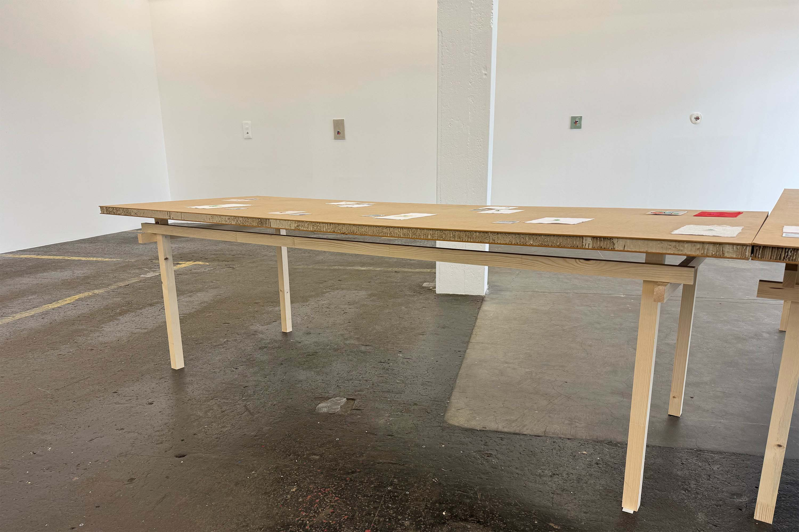
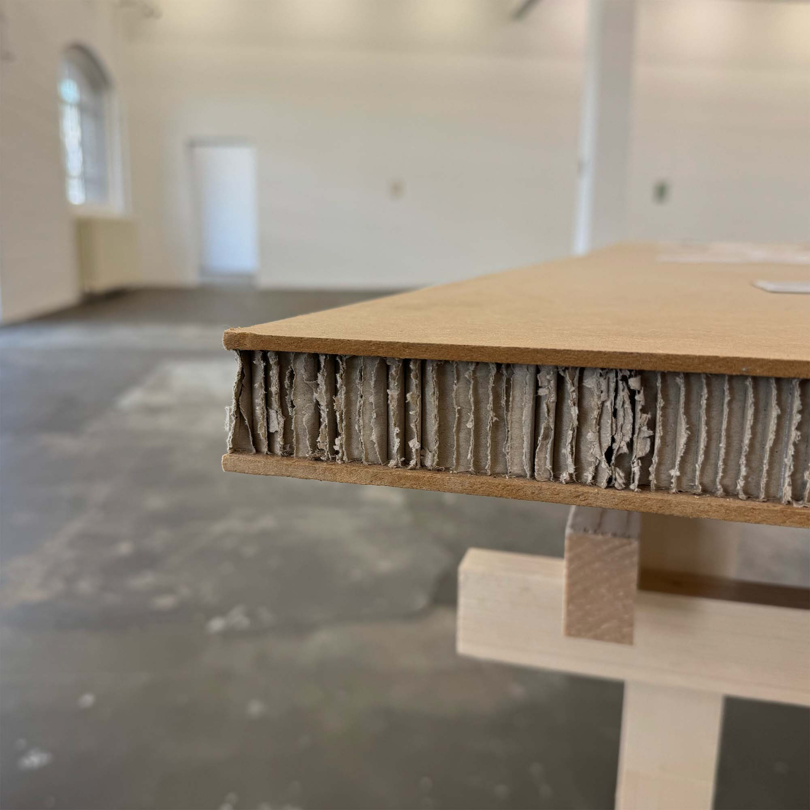

# miniTable

An interactive 3D table generator that allows you to design and visualize minimalistic custom tables in real-time.

<video src='https://github.com/user-attachments/assets/fd2dbe8a-2fe7-4bf9-aeff-2c08c5b1ca76'></video>

## Features

- Adjust table dimensions
- Adjust support bar dimensions
- View your design from any angle with 3D controls
- Line Art visualization

Open `index.html` in a modern web browser to start designing your custom table.

## Sources

The Design was inspired by a table seen at [Kunst Halle Sankt Gallen](https://www.kunsthallesanktgallen.ch/)

Thanks to the following resources for inspiration and code snippets.

- [threejs.org forum - How to render geometry edges](https://discourse.threejs.org/t/how-to-render-geometry-edges/5745/2)
- [threejs.org forum - How to create this smooth cartoon style with outlines in three.js](https://discourse.threejs.org/t/how-to-create-this-smooth-cartoon-style-with-outlines-in-three-js/60862)
- [Stack Overflow - How to get three.js linesegments to only render visible lines](https://stackoverflow.com/questions/56795062/how-to-get-three-js-linesegments-to-only-render-visible-lines/)
- [Pencil Lines post-processing](https://github.com/mayacoda/pencil-lines)
